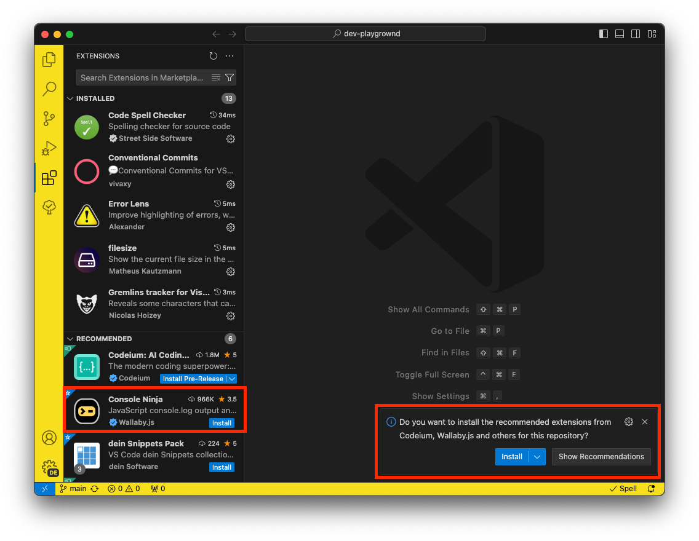
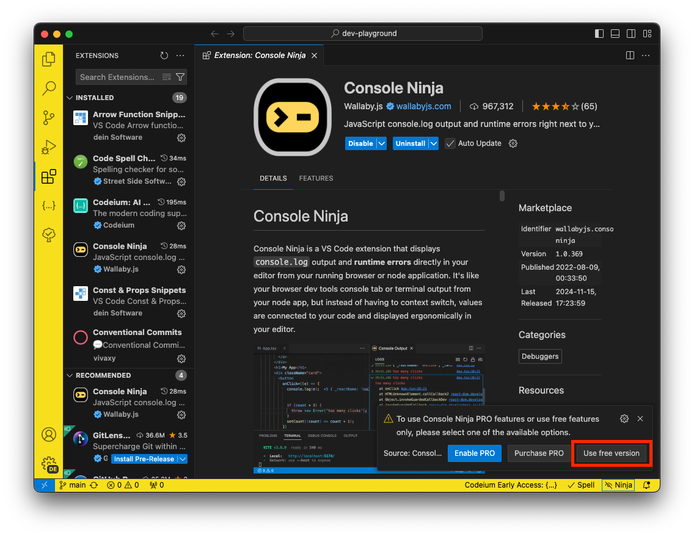

# Dev Playground

This project was inspired as alternative to [RunJS](https://runjs.app/), due to its current limitation of 50 runs per day.

Additionally, by using `vscode` and local `terminal`, you can leverage all the tools, extensions, and configurations that you prefer.

Without ridiculous limitations, like pay to use external package depencies, use all the tabs that you need, change themes, install extensions and snippets. All for **FREE**.

## Pre-requisites

Run the following command to install the dependencies:

```bash
npm install
```

## Extensions



While there are several recommended extensions for this project, the only mandatory one is `Console Ninja` and choose `[Use free version]`.



> `console-ninja` CLI does not support node `18+` versions. So we need to use node `16` version.  
> Once the new version compatible with `22+` version this project will be updated using `watch` and `--experimental-strip-types`

## Output

To view the output, open the command palette with `cmd+shift+p` (macOS) or `ctrl+shift+p` (Windows/Linux) and execute the `Console Ninja: Show Output` command. You can then move this tab to a preferred position within your workspace for convenience.

## Run

Open terminal and run one of those commands:

| Language   | Command                             |
| ---------- | ----------------------------------- |
| JavaScript | `npm run js <javascript file path>` |
| TypeScript | `npm run ts <typescript file path>` |

## About

### Built With

- [VS Code](https://code.visualstudio.com/) - Code editing redefined.
- [TypeScript](https://www.typescriptlang.org) - JavaScript With Syntax For Types.
- [Node.js](https://nodejs.org/) - A JavaScript runtime built on Chrome's V8 JavaScript engine.
- [Codeium](https://codeium.com/) - Free AI code completion and chat.

### NPM Packages

- [console-ninja](https://www.npmjs.com/package/console-ninja) - output and runtime errors directly in your editor from.
- [nodemon](https://www.npmjs.com/package/nodemon) - tool that helps develop Node.js based applications by automatically restarting the node application when file changes are detected.
- [tsx](https://www.npmjs.com/package/tsx) - the easiest way to run TypeScript in Node.js
.

### Contributing

Please read [CONTRIBUTING](CONTRIBUTING.md) for details on our code of conduct, and the process for submitting pull requests to us.

### Versioning

We use [SemVer](http://semver.org/) for versioning. For the versions available, see the [dev-playground](https://github.com/deinsoftware/dev-playground/tags) on GitHub.

### Authors

- **Camilo Martinez** [[Equiman](http://github.com/equiman)]

### Contributors

[](https://github.com/equiman)

See also the list of [contributors](https://github.com/deinsoftware/dev-playground/contributors) who participated in this project.

### Sponsors

If this project helps you, consider buying me a cup of coffee.

[](https://github.com/sponsors/deinsoftware)
[](https://paypal.me/equiman/3)
