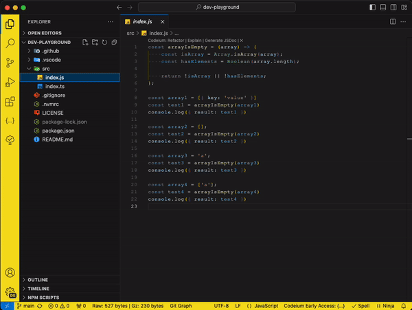
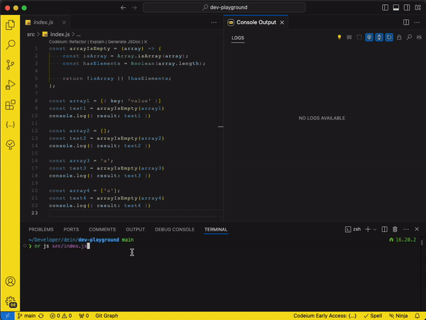

# Dev Playground

This project was inspired as an alternative to [RunJS](https://runjs.app/), a commendable project. However, the limitations of its free plan, such as the restriction to 50 runs per day, prompted us to create a more open solution.

Dev Playground is a pre-configured project over `vscode` and the community version of `console-ninja`, designed to provide a more open and flexible solution, free from limitations.

By leveraging your local environment and the power of `vscode` and its extensions, you have complete control over your development experience. There are no restrictions on the number of runs, saving files, using external packages, managing multiple tabs, customizing themes, or installing extensions.

---

## Menu

- [Setup](#setup)
- [Playground](#playground)
- [About](#about)

---

## Setup

### Clone

Clone this repository to your local environment:

```bash
git clone https://github.com/deinsoftware/dev-playground.git
```

> [!TIP]
> Consider forking this repository to your GitHub account. This approach allows you to leverage the advantages of a Git repository, enabling you to save and manage your experiments on GitHub.

### Dependencies

Then, run the following command to install the dependencies:

```bash
npm install
```

### Extensions


While there are several recommended extensions for this project, the only mandatory one is `Console Ninja` and choose `[Use free version]`.


> Console Ninja supports virtually any node application (starting from node v16.15.0). Ensure that your system uses a version above with `nvm` or `volta`.

⇧ [Back to menu](#menu)

---

## Playground

### Output

Run `console-ninja` and open the **show output` tab.



### Run

Open terminal and run one of those commands:

| Language   | Command                              |
| ---------- | ------------------------------------ |
| JavaScript | `npm run js <javascript file path>`  |
| TypeScript | `npm run ts <typescript file path>`  |
| TypeScript | `npm run tsx <typescript file path>` |

> The `ts` command executes with Node.js using the `--experimental-strip-types` flag. In case of any issues, `tsx` serves as an alternative to execute TypeScript.



⇧ [Back to menu](#menu)

---

## About

### Built With

- [VS Code](https://code.visualstudio.com/) - Code editing redefined.
- [TypeScript](https://www.typescriptlang.org) - JavaScript With Syntax For Types.
- [Node.js](https://nodejs.org/) - A JavaScript runtime built on Chrome's V8 JavaScript engine.
- [Codeium](https://codeium.com/) - Free AI code completion and chat.

### NPM Packages

- [console-ninja](https://www.npmjs.com/package/console-ninja) - output and runtime errors directly in your editor from.
- [tsx](https://www.npmjs.com/package/tsx) - the easiest way to run TypeScript in Node.js

### Documentation

- Official `console-ninja` documentation about [Universal Node applications](https://github.com/wallabyjs/console-ninja?tab=readme-ov-file#universal-node-applications) configuration.

### Contributing

Please read [CONTRIBUTING](CONTRIBUTING.md) for details on our code of conduct, and the process for submitting pull requests to us.

### Versioning

We use [SemVer](http://semver.org/) for versioning. For the versions available, see the [dev-playground](https://github.com/deinsoftware/dev-playground/tags) on GitHub.

### Authors

- **Camilo Martinez** [[Equiman](http://github.com/equiman)]

### Contributors

[](https://github.com/equiman)

See also the list of [contributors](https://github.com/deinsoftware/dev-playground/contributors) who participated in this project.

### Sponsors

If this project helps you, consider buying me a cup of coffee.

[](https://github.com/sponsors/deinsoftware)
[](https://paypal.me/equiman/3)

⇧ [Back to menu](#menu)
